<div align="center">

# Serein Market

### A full-stack grocery e-commerce website built with Angular

Responsive shopping flows, signal-based state management, role-aware navigation, and a complete administration workspace—all connected to a production REST API.

[](https://angular.dev/)
[](https://www.typescriptlang.org/)
[](https://tailwindcss.com/)
[](https://nestjs.com/)
[](https://www.prisma.io/)
[](https://www.postgresql.org/)

</div>

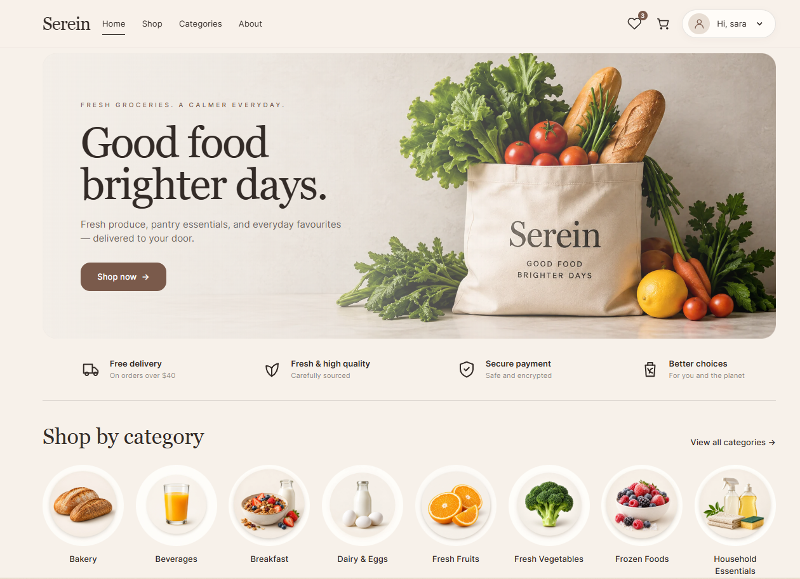

## Overview

Serein Market is an online grocery store that covers the complete journey from product discovery to order management. It was built to demonstrate production-oriented Angular development—including typed API integration, authentication, route protection, reusable state stores, form validation, responsive layouts, and distinct customer and administrator experiences.

The public repository contains the **Angular frontend**. The backend is a separate, NestJS application; its technology and responsibilities are documented below so the architecture is clear.

## What this project demonstrates

- Modern Angular architecture using standalone components and lazy-loaded feature routes
- Fine-grained reactive state with `Signals`, `computed`, and `effect`
- Typed HTTP services and centralized state stores for auth, products, categories, cart, wishlist, customers, and orders
- Signal Forms with client-side validation and server-error feedback
- JWT authentication through a functional HTTP interceptor
- Customer, checkout, and administrator route guards
- Responsive, accessible UI with reusable components, loading states, empty states, confirmation dialogs, and toast notifications
- URL-aware product filtering and pagination so catalogue state remains navigable
- Full frontend-to-REST-API integration across shopper and administrator workflows

## Features

### Customer experience

- Account registration, sign-in, sign-out, and profile editing
- Responsive landing page with featured products and category discovery
- Product catalogue with search, multi-category filtering, price range, stock filtering, sorting, and pagination
- Product detail pages with live price and availability information
- Persistent, server-backed wishlist and shopping cart
- Cart quantity controls, item removal, totals, and guarded checkout
- Delivery details and payment-method selection at checkout
- Order confirmation, order history, detailed order views, and eligible order cancellation

### Administration

- KPI dashboard for products, categories, customers, and orders
- Order-status visualization, recent activity, and low/out-of-stock inventory alerts
- Searchable product management with create, edit, archive/delete, stock, SKU, pricing, category, and image controls
- Category creation, editing, deletion, detail views, and associated product visibility
- Searchable customer directory with contact details and complete order history
- Searchable order management with customer, delivery, item, payment, and total information
- Controlled order transitions from pending through confirmed, shipped, and delivered, with cancellation support
- Responsive administration navigation for desktop and mobile layouts

## Product tour

### Shopping and checkout

<table>
  <tr>
    <td width="50%">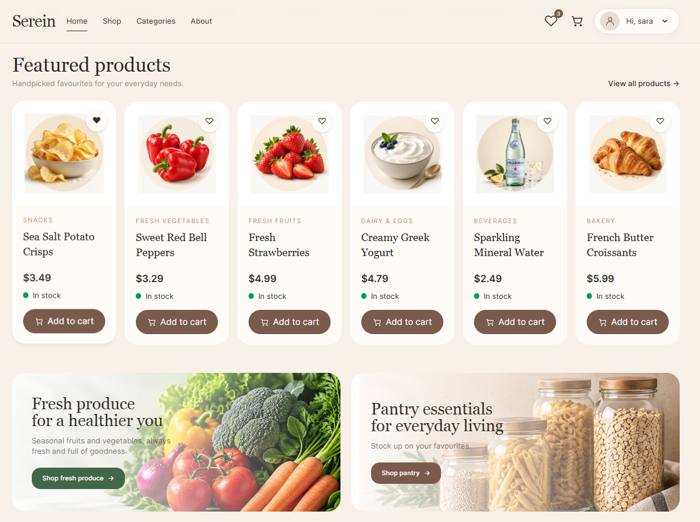</td>
    <td width="50%">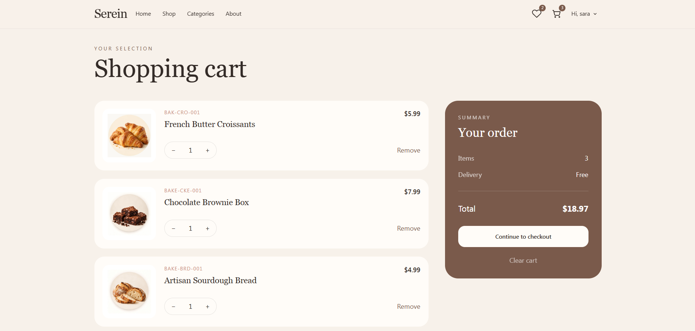</td>
  </tr>
  <tr>
    <td align="center"><strong>Curated storefront</strong></td>
    <td align="center"><strong>Server-backed cart</strong></td>
  </tr>
  <tr>
    <td width="50%">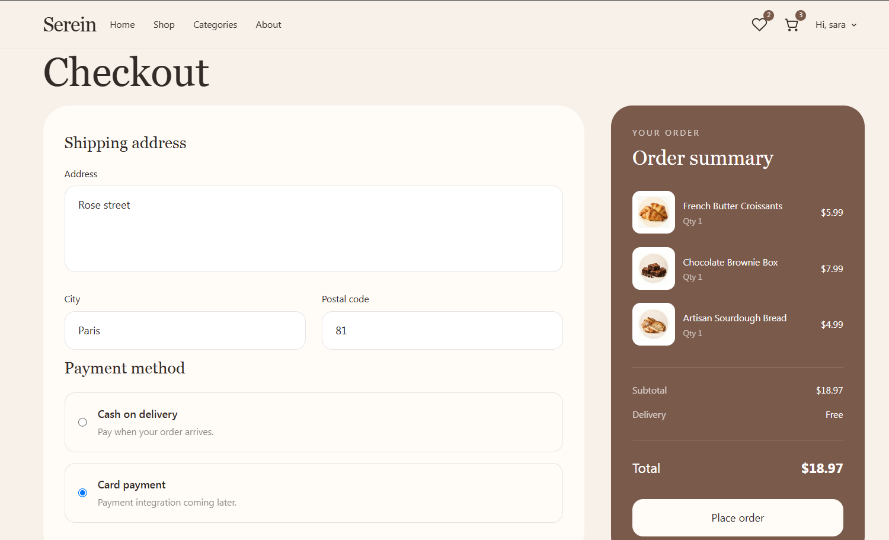</td>
    <td width="50%">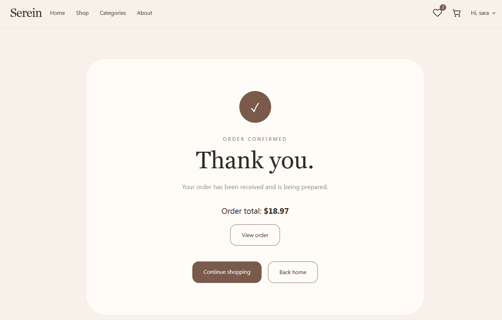</td>
  </tr>
  <tr>
    <td align="center"><strong>Validated checkout</strong></td>
    <td align="center"><strong>Order confirmation</strong></td>
  </tr>
</table>

### Customer orders

<table>
  <tr>
    <td width="50%">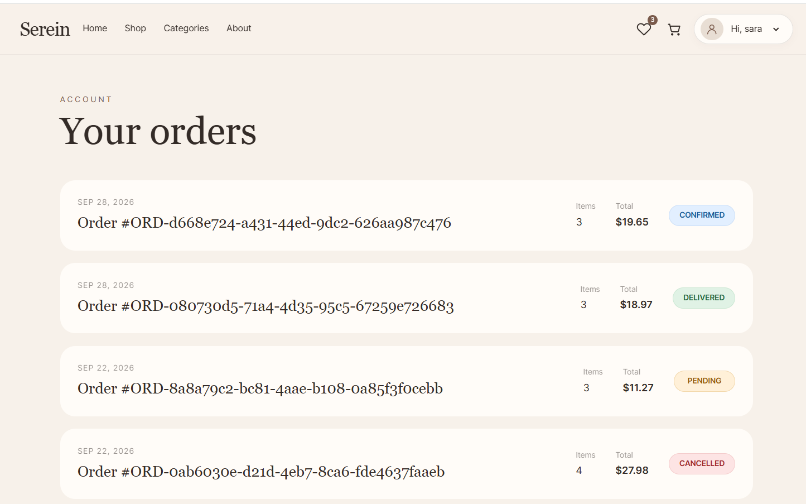</td>
    <td width="50%">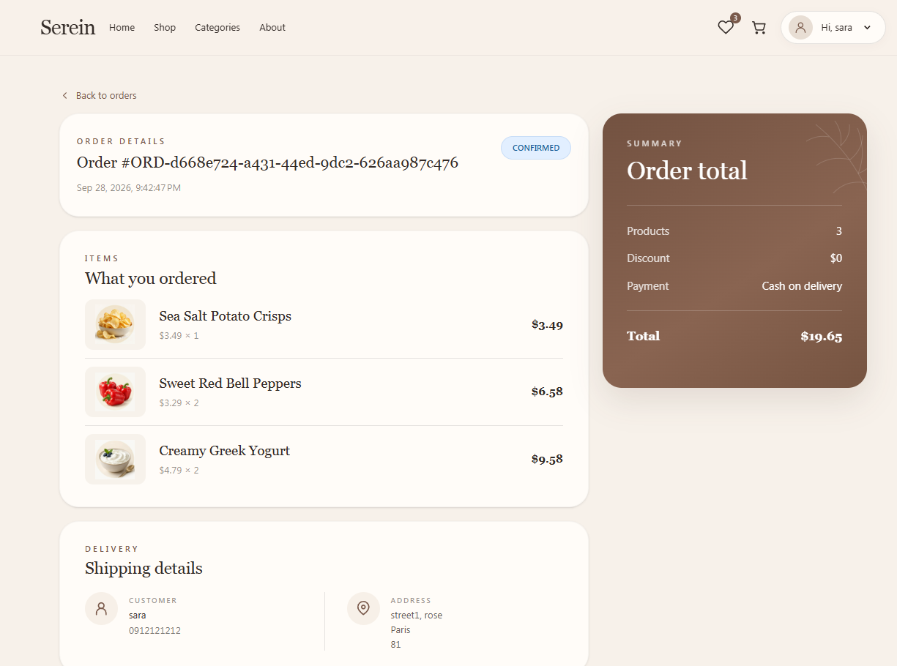</td>
  </tr>
  <tr>
    <td align="center"><strong>Order history</strong></td>
    <td align="center"><strong>Order details and cancellation</strong></td>
  </tr>
</table>

### Admin dashboard

<table>
  <tr>
    <td width="50%">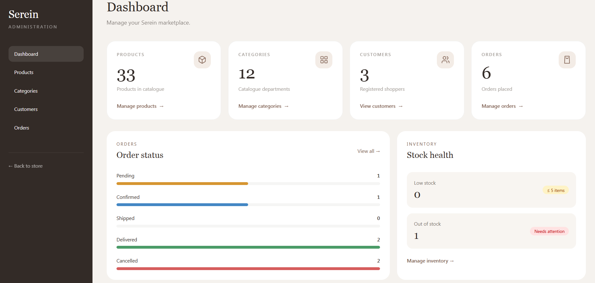</td>
    <td width="50%">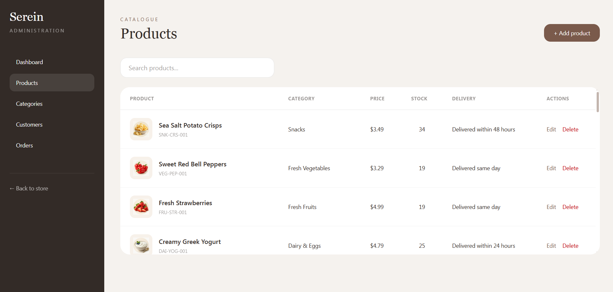</td>
  </tr>
  <tr>
    <td align="center"><strong>Business overview</strong></td>
    <td align="center"><strong>Inventory and recent activity</strong></td>
  </tr>
</table>

### Catalogue management

<table>
  <tr>
    <td width="50%">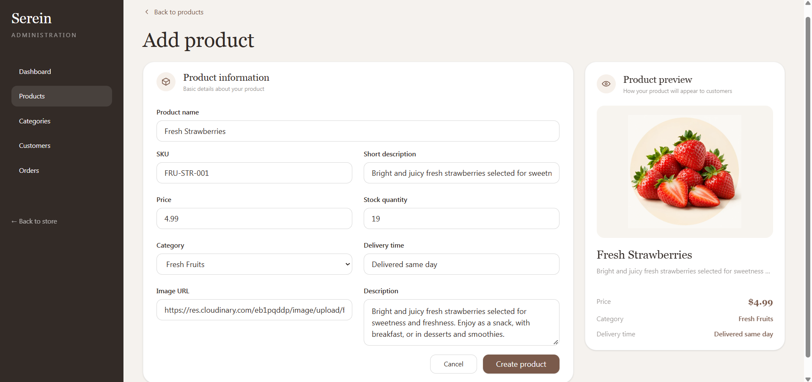</td>
    <td width="50%">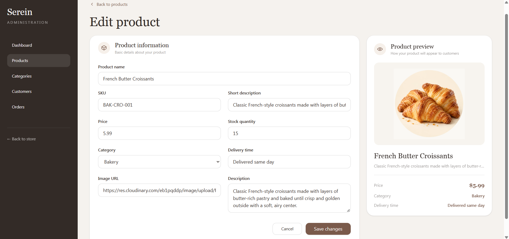</td>
  </tr>
  <tr>
    <td align="center"><strong>Create products</strong></td>
    <td align="center"><strong>Edit products and inventory</strong></td>
  </tr>
  <tr>
    <td width="50%">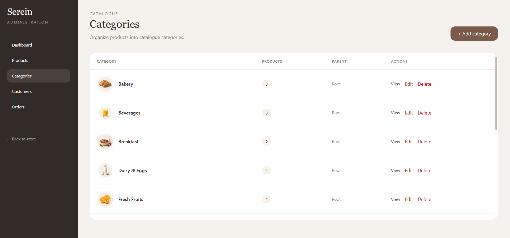</td>
    <td width="50%">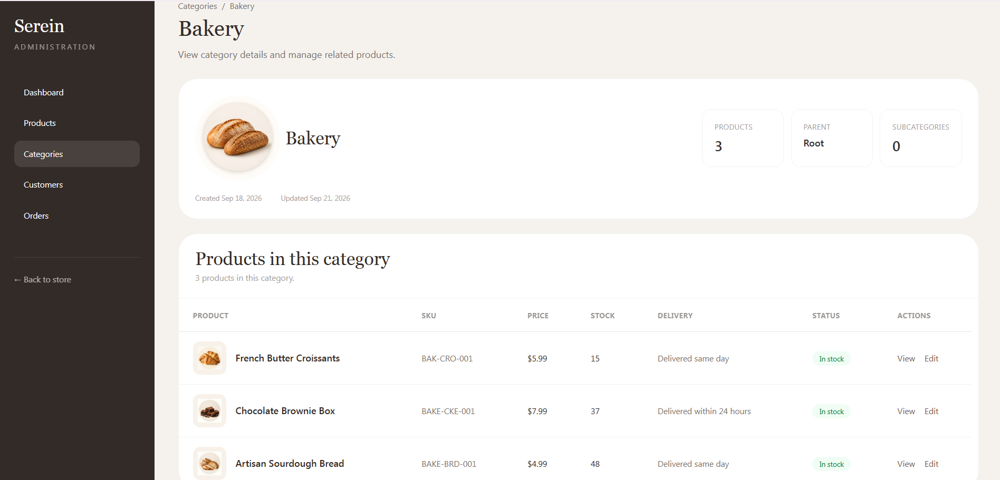</td>
  </tr>
  <tr>
    <td align="center"><strong>Manage categories</strong></td>
    <td align="center"><strong>Inspect category products</strong></td>
  </tr>
</table>

### Orders and customers

<table>
  <tr>
    <td width="50%">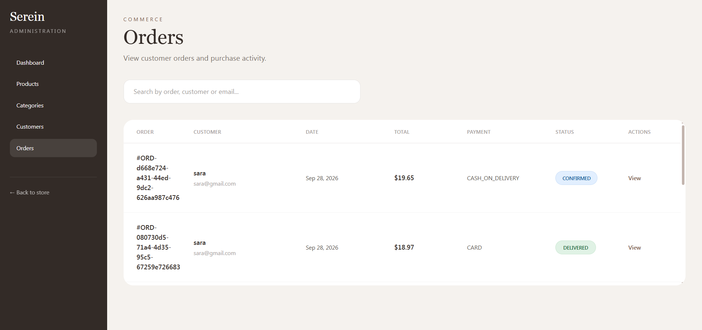</td>
    <td width="50%">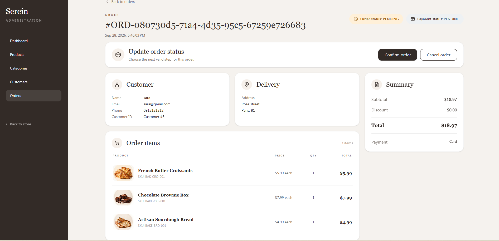</td>
  </tr>
  <tr>
    <td align="center"><strong>Search and review orders</strong></td>
    <td align="center"><strong>Manage order status</strong></td>
  </tr>
  <tr>
    <td width="50%">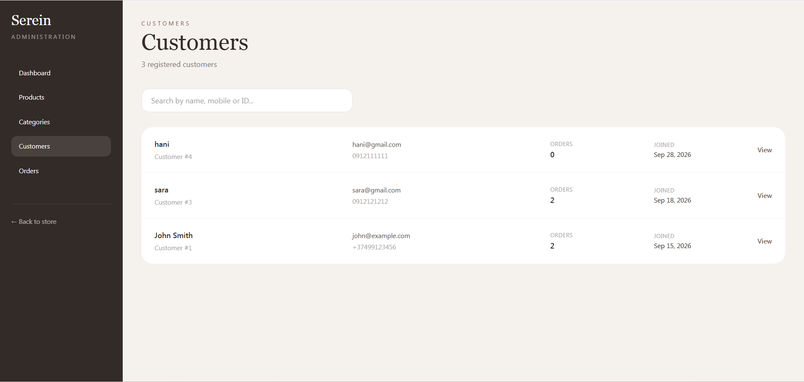</td>
    <td width="50%">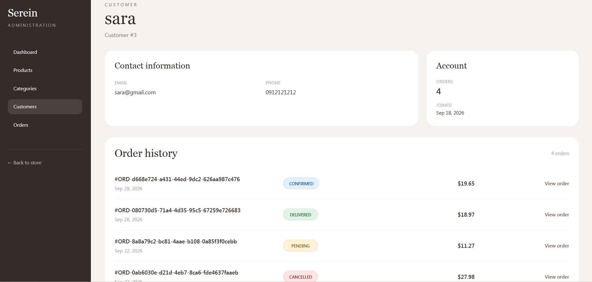</td>
  </tr>
  <tr>
    <td align="center"><strong>Customer directory</strong></td>
    <td align="center"><strong>Customer details and history</strong></td>
  </tr>
</table>

<details>
<summary><strong>More admin workflow screenshots</strong></summary>

<br>

<table>
  <tr>
    <td width="50%">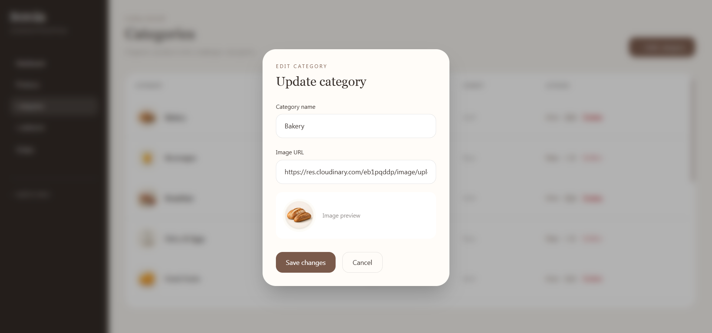</td>
    <td width="50%">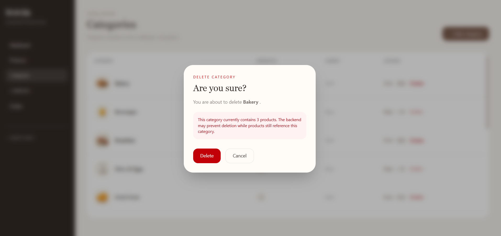</td>
  </tr>
  <tr>
    <td align="center"><strong>Category editing</strong></td>
    <td align="center"><strong>Protected destructive actions</strong></td>
  </tr>
  <tr>
    <td width="50%">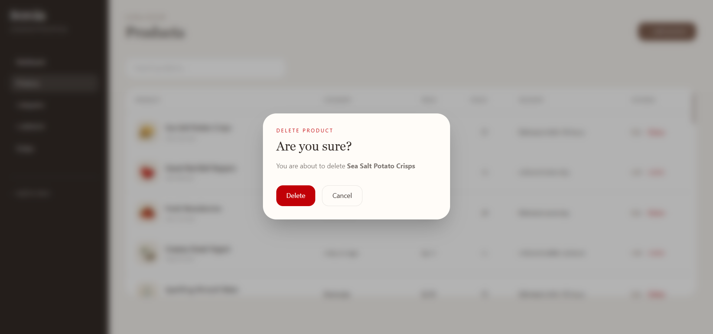</td>
    <td width="50%">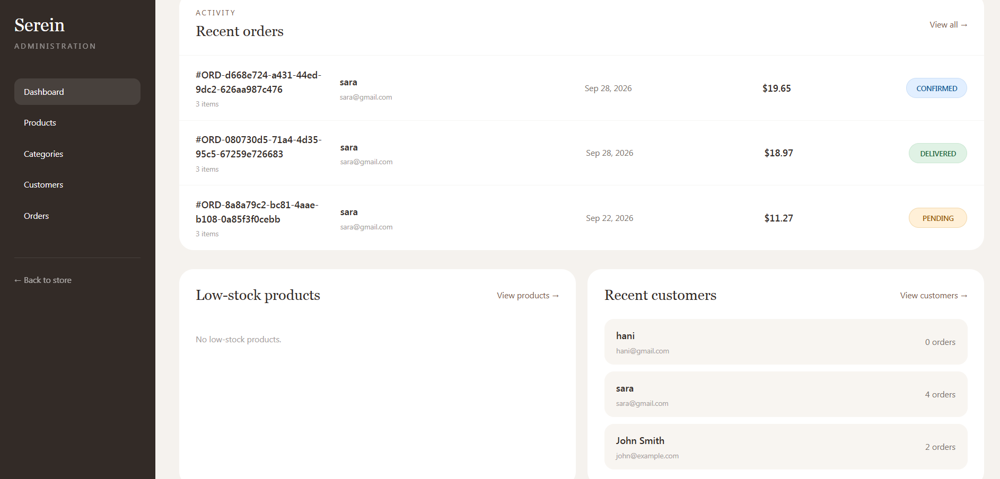</td>
  </tr>
  <tr>
    <td align="center"><strong>Product deletion confirmation</strong></td>
    <td align="center"><strong>Operational overview</strong></td>
  </tr>
</table>

</details>

## Architecture

The frontend separates transport, application state, and presentation concerns:

```text
src/app/
├── core/
│   ├── api/          # Typed REST clients and response mapping
│   ├── auth/         # Session state, token storage, and HTTP interceptor
│   ├── guards/       # Authentication, admin, and checkout protection
│   ├── models/       # Domain and API contracts
│   └── state/        # Signal-based feature stores
├── features/
│   ├── account/      # Profile and customer orders
│   ├── admin/        # Dashboard and management workflows
│   ├── auth/         # Login and registration
│   ├── cart/         # Cart experience
│   ├── checkout/     # Checkout and success flow
│   ├── products/     # Catalogue, filters, cards, and details
│   └── wishlist/     # Saved products
├── layout/           # Store and admin application shells
└── shared/ui/        # Reusable icons, badges, and notifications
```

All route-level pages are lazy loaded with `loadComponent`. API access is isolated behind injectable services, while feature stores expose readonly signal state and coordinate asynchronous operations. This keeps components focused on interaction and presentation and avoids coupling templates directly to HTTP behavior.


## Backend design

The backend is a modular NestJS REST API. Separate domain modules handle authentication, users, products, categories, carts, wishlists, orders, and admin customer operations. Requests enter through versioned `/api/v1` controllers, are validated and transformed by NestJS DTO pipelines, pass through the relevant service and authorization rules, and reach PostgreSQL through Prisma.

The relational database was designed around the main commerce workflows:

- A user has one cart, one wishlist, and many orders.
- Categories support parent-child relationships and contain products.
- Cart and wishlist item tables connect users' collections to products while preventing duplicate entries.
- Orders contain delivery and payment details, while order items preserve product name, SKU, image, and price snapshots so historical purchases remain accurate when catalogue data changes.

Passwords are hashed with Argon2, authenticated requests use JWTs, and administrator endpoints are protected by server-side role guards. Global validation rejects unexpected payload fields, while Swagger/OpenAPI documents the API contract used by the Angular client.


## Technology

| Layer               | Technologies                                                                                      |
| ------------------- | ------------------------------------------------------------------------------------------------- |
| Frontend            | Angular 22, TypeScript 6, Angular Signals, Signal Forms, Angular Router, Angular HttpClient, RxJS |
| Styling             | Tailwind CSS 4, responsive layouts, custom design tokens, component-scoped CSS                    |
| Backend API         | NestJS 12, TypeScript, REST, JWT, Argon2, class-validator, Swagger/OpenAPI                        |
| Data                | PostgreSQL, Prisma ORM 7                                                                          |
| Testing and tooling | Vitest, Angular CLI, Prettier                                                                     |
| Deployment          | Vercel frontend, Render backend, Cloudinary-hosted imagery                                            |

## Authentication and access control

Authentication uses a JWT access token and a centralized interceptor for authorized requests. Angular guards improve navigation and protect customer, checkout, and admin routes in the client. Authorization is also enforced by the private API with JWT and role guards—the frontend guard is not treated as a security boundary.

Public users can create a customer account and explore the normal shopping journey. Administrator credentials are deliberately excluded from this repository and will not be shared publicly.

## Run the frontend locally

### Prerequisites

- Node.js compatible with Angular 22
- npm 11 or newer

### Setup

```bash
git clone https://github.com/hadis98/serein-market-frontend.git
cd serein-market-frontend
npm ci
npm start
```

Open `http://localhost:4200`.


### Available commands

```bash
npm start          # Start the Angular development server
npm run build      # Create an optimized production build
npm test           # Run the Vitest test suite
npm run watch      # Rebuild on source changes in development mode
```


<div align="center">
Built as an end-to-end demonstration of modern Angular application development.
</div>
